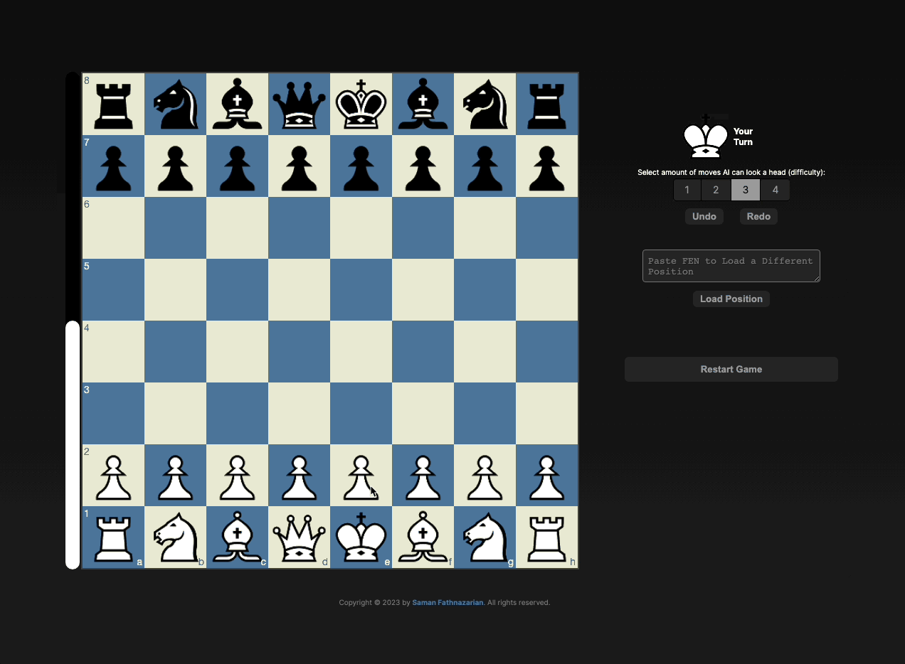

# Chess AI

A chess AI program built using JavaScript and advanced algorithms such as Minimax with Alpha-Beta pruning and Information Theory.

## Features
- Provides a challenging and dynamic opponent for players of all skill levels
- Efficiently searches through vast numbers of potential moves and makes intelligent decisions
- Offers a personalized chess experience with adjustable AI difficulty
- User-friendly interface for an enjoyable playing experience

### Author

Saman Fathnazarian - <a href="https://imsaman.com" target="_blank">https://imsaman.com</a>